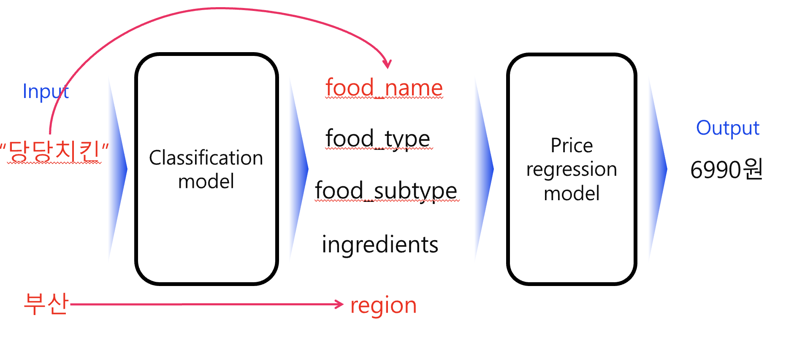
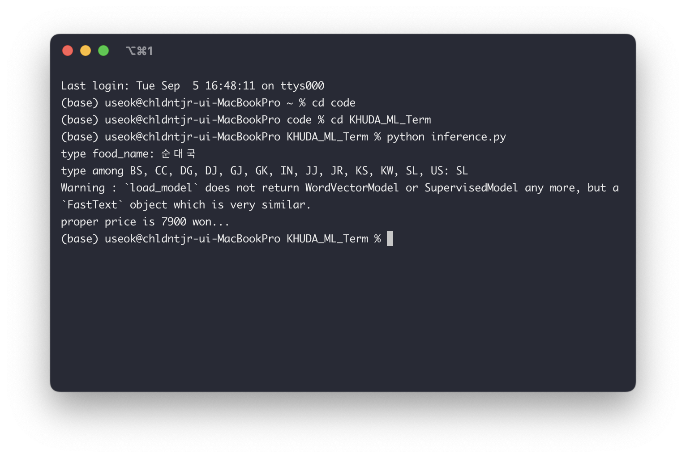

## KHUDA ML Toy_Project 비대면조

# 외국인 관광객을 위한 관광지 내 음식 가격 합리성 판별

### Data: https://www.aihub.or.kr/aihubdata/data/view.do?currMenu=115&topMenu=100&aihubDataSe=realm&dataSetSn=71553

### Used Model
- Pretrained FastText word embedding moel
- MLP
- Logistic Regression

## Model architecture

## inference

